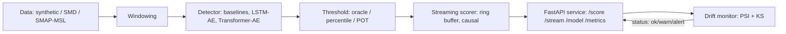
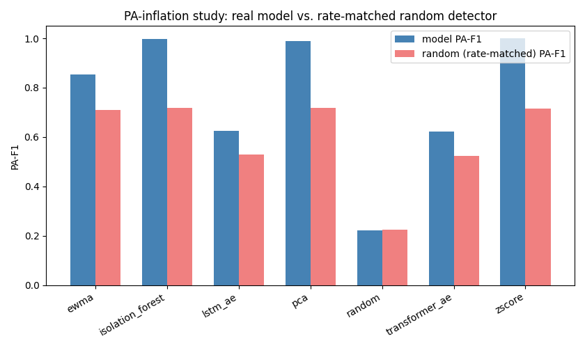

# DriftSentrix

*(package name: `anomaly` — see `pyproject.toml`; DriftSentrix is this project's name)*

Streaming multivariate time-series anomaly detection with an honest evaluation
protocol, a served streaming scorer, and drift monitoring.

## The problem

Detecting faults in a multivariate sensor/server stream, with few or no
labeled anomalies, where false alarms are costly. This repo builds and
evaluates the full pipeline: baselines through deep autoencoders, principled
threshold selection, a causal streaming scorer behind a real HTTP service,
and drift monitoring on the live input.

## Why "honest evaluation"

Point-adjusted F1 (PA-F1) — the metric most anomaly-detection papers report —
inflates scores: if **any** point inside a true anomalous segment is flagged,
the **whole segment** counts as detected. A detector with a high enough false
alarm rate can look excellent under PA-F1 while barely working at all. This
repo reports point-F1, PA-F1, and event-F1 side by side, always, and includes
a dedicated **PA-inflation study** that proves the gap with a rate-matched
random detector — see the Results section below for the actual numbers this
produces, not an assertion.

## Architecture



Full component breakdown and the causality guarantee: `docs/ARCHITECTURE.md`.

## Quickstart

**bash / zsh**
```bash
pip install -e . -r requirements.txt
pytest -q                                              # 137 tests, ~17s
python -m anomaly.run_baselines --dataset synthetic
```

**PowerShell**
```powershell
pip install -e . -r requirements.txt
pytest -q
python -m anomaly.run_baselines --dataset synthetic
```

Fast tests only (skip the ones that train real torch models, ~8s):
```bash
pytest -q -m "not slow"
```

## Reproducing the results below

```bash
python -m anomaly.experiment --config configs/full_benchmark.yaml
python -m anomaly.report
python -m anomaly.scripts.pa_inflation_study --config configs/full_benchmark.yaml
python scripts/bench_latency.py --model lstm_ae
python scripts/bench_latency.py --model transformer_ae
python scripts/build_readme_results.py
```

`configs/full_benchmark.yaml` runs all 7 detectors (5 baselines + LSTM-AE +
Transformer-AE) across 3 seeds on synthetic data, at oracle / train-percentile
/ POT thresholds. Everything below this line is regenerated by that command,
not hand-typed — see `scripts/build_readme_results.py`.

<!-- RESULTS:START -->
*Generated by `scripts/build_readme_results.py` -- every number below is read from a file, never hand-typed.*

### Point-F1 vs PA-F1 vs Event-F1 (oracle threshold, mean across seeds)

| model            |   point_f1 |   pa_f1 |   event_f1 |
|:-----------------|-----------:|--------:|-----------:|
| lstm_ae          |      0.625 |   0.625 |      1.000 |
| transformer_ae   |      0.621 |   0.621 |      1.000 |
| zscore           |      1.000 |   1.000 |      1.000 |
| ewma             |      0.759 |   0.855 |      0.941 |
| isolation_forest |      0.997 |   0.997 |      0.933 |
| pca              |      0.948 |   0.990 |      0.923 |
| random           |      0.108 |   0.223 |      0.098 |

### Same models, deployable threshold (train_percentile, no test labels used)

| model            |   point_f1 |   pa_f1 |   event_f1 |   false_alarms_per_1000 |
|:-----------------|-----------:|--------:|-----------:|------------------------:|
| lstm_ae          |      0.619 |   0.625 |      1.000 |                   0.000 |
| transformer_ae   |      0.617 |   0.617 |      1.000 |                   0.000 |
| isolation_forest |      0.990 |   0.990 |      0.800 |                   1.000 |
| ewma             |      0.704 |   0.704 |      0.500 |                   4.000 |
| zscore           |      0.917 |   0.917 |      0.308 |                   9.000 |
| pca              |      0.787 |   0.806 |      0.267 |                  22.000 |
| random           |      0.000 |   0.000 |      0.000 |                   4.667 |

### PA-inflation study

A pure-random detector, flagging points at the same rate as each real detector above, scores a mean point-F1 of **0.097** but a mean PA-F1 of **0.621** -- a **6.4x inflation** from the metric alone, with zero actual detection ability behind it. See `reports/figures/pa_inflation.png` and `reports/pa_inflation.csv` for the full per-model breakdown.

### LSTM-AE streaming latency (in_process, n=1000)
p50 **0.27 ms**, p95 **0.34 ms**, p99 **0.35 ms** -- throughput **3569 points/s**.

### Transformer-AE streaming latency (in_process, n=1000)
p50 **0.20 ms**, p95 **0.30 ms**, p99 **0.38 ms** -- throughput **4590 points/s**.

<!-- RESULTS:END -->



*(This figure is committed for visibility — everything else in the Results section above is generated fresh by the reproduction command; regenerate it and it will match `reports/figures/pa_inflation.png`.)*

## Running the service

```bash
python -m anomaly.export --config configs/deploy_lstm_ae.yaml --model lstm_ae \
    --threshold-mode pot --out artifacts/model_v1
MODEL_DIR=artifacts/model_v1 python -m uvicorn anomaly.serve.app:app --host 127.0.0.1 --port 8000
```

Then `curl http://127.0.0.1:8000/health`, or open `/docs` in a browser for
interactive Swagger docs. Full endpoint list, per-entity streaming state,
and the drift-monitoring contract: `docs/ARCHITECTURE.md`.

```bash
docker compose up   # requires artifacts/model_v1 to already exist (see export step above)
```

## Live demo

`streamlit_app.py` is a separate, lighter demo layer for visual exploration
(live baseline detection on synthetic data, the PA-inflation study, and a
CSV upload tab) — the FastAPI service above is the actual production-shaped
deliverable; this is the clickable version for browsing without running
anything locally.

```bash
streamlit run streamlit_app.py
```

## Limitations

- **Synthetic data only in this README's numbers.** SMD/SMAP-MSL loaders
  are implemented and tested (`data/loaders.py`), but real-data results
  require downloading those datasets locally (`data/README.md`) — run
  `configs/full_benchmark.yaml`-style configs with `dataset: smd` once you
  have them; nothing here claims real-dataset numbers it didn't produce.
- **Streaming scoring re-computes the full window on every push**, not an
  O(1) incremental update, for every detector except EWMA (which has genuine
  recurrent state). Correct, proven equal to batch scoring
  (`tests/test_streaming_scorer.py`), but not the most efficient possible
  design at very high throughput. See `src/anomaly/streaming/scorer.py`.
- **PSI is noisy on small windows.** A monitor expecting a 500-point window
  can show elevated PSI on as few as 30-50 points from the *same*
  distribution, from sampling noise alone — see `docs/EVALUATION.md` and
  `src/anomaly/monitor/drift.py`'s docstring.
- **POT needs enough validation data.** With too few excesses over the
  chosen quantile, the GPD fit is unreliable — the code detects this and
  warns (`MIN_EXCESSES_FOR_FIT` in `eval/pot.py`) rather than silently
  returning a bad threshold.
- **Docker build was written but not verified in every environment** it
  might run in (works from a standard Docker install; not verified inside
  every possible sandboxed CI runner).

## Roadmap

- Real-data results (SMD, SMAP/MSL) once downloaded locally
- TranAD-style two-phase Transformer variant (stretch item in `AGENTS.md`)
- Streaming SPOT (adaptive POT that updates with non-alarm points)
- Per-entity model sharding for the service, beyond the current shared-model /
  per-entity-state design

## Docs

- `docs/ARCHITECTURE.md` — component breakdown, Mermaid diagram, causality guarantee
- `docs/EVALUATION.md` — metric definitions, oracle vs. deployable thresholds, POT/PSI caveats
- `docs/ASSUMPTIONS.md` — open assumptions and TODOs
- `reports/model_card.md` — intended use, training data, failure modes, ethical notes
